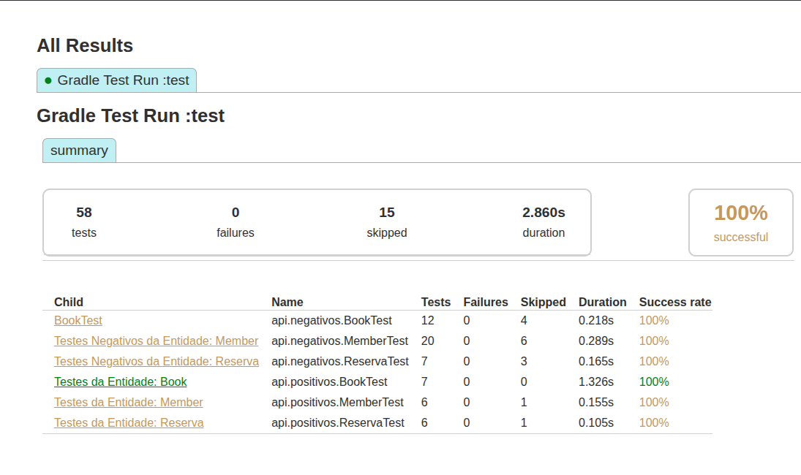

# Library API Integration Tests

This repository contains an integration test suite for a Library Management API. The tests validate the behaviour of three main resources:

- Books
- Members
- Reservations

The goal of the project is to verify that the API works correctly across complete business flows, not only isolated endpoints. The test suite covers successful operations, validation errors, invalid identifiers, duplicated data, and business rules involving active reservations.

## Project Structure

```text
.
|-- ProjetoFinal-TSW - api-testing-boilerplate/
|   |-- build.gradle
|   |-- src/main/java/api/
|   |   |-- retrofit/
|   |   `-- validators/
|   `-- src/test/java/api/
|       |-- BaseTest.java
|       |-- classes/
|       |-- helpers/
|       |-- positivos/
|       `-- negativos/
`-- Resultados/
    |-- resultados-livros.xlsx
    |-- resultados-membros.xlsx
    `-- resultados-reservas.xlsx
```

## Technology Stack

- Java
- Gradle
- JUnit 5 / JUnit Platform
- REST Assured
- Hamcrest
- Retrofit and OkHttp support classes
- Lombok

## API Under Test

The tests are configured to run against:

```text
http://localhost:8080
```

This configuration is defined in `src/test/java/api/BaseTest.java` through REST Assured:

```java
RestAssured.baseURI = "http://localhost";
RestAssured.port = 8080;
```

Before running the suite, the API server must be running locally on port `8080`.

## Running the Tests

From the Gradle project folder:

```bash
cd "ProjetoFinal-TSW - api-testing-boilerplate"
./gradlew test
```

The project also defines an `integrationTests` Gradle task:

```bash
./gradlew integrationTests
```

Test execution logs are configured to show passed, skipped, and failed tests, including standard output.

## Test Coverage

The suite contains 58 numbered test cases, organized into positive and negative scenarios.

### Books

Positive tests validate:

- Creating a book successfully
- Listing books
- Retrieving a book by ID
- Updating book fields
- Deleting a book
- Deleting a book with an active reservation using `forceRemove=true`
- Confirming that a reserved book changes status to `RESERVED`

Negative tests validate:

- Invalid data types
- Missing request body
- Empty or null mandatory fields
- Invalid book status
- Invalid edition year, including future years
- Invalid or duplicated ISBN
- Invalid and non-existing IDs
- Deleting a book associated with an active reservation without `forceRemove`

### Members

Positive tests validate:

- Creating a member successfully
- Listing members
- Retrieving a member by ID
- Updating member data
- Deleting a member
- Deleting a member with an active reservation using `forceRemove=true`

Negative tests validate:

- Invalid data types
- Missing request body
- Empty or null mandatory fields
- Invalid date formats
- Future birth dates or registration dates
- Invalid postal code
- Invalid phone number
- Invalid NIF
- Invalid email
- Duplicated NIF, email, or phone number
- Invalid and non-existing IDs
- Deleting a member associated with an active reservation without `forceRemove`

### Reservations

Positive tests validate:

- Creating a reservation
- Listing active reservations
- Retrieving a reservation by reservation ID
- Retrieving reservations by member ID
- Retrieving reservations by book ID
- Updating a reservation by setting its return date
- Confirming that the return date is after the reservation date

Negative tests validate:

- Creating reservations with invalid or non-existing member/book IDs
- Preventing a second active reservation for an already reserved book
- Retrieving reservations with invalid or non-existing IDs
- Updating reservations with invalid or non-existing IDs
- Preventing a reservation from being returned more than once

## Good Practices Implemented

### Clear Separation Between Positive and Negative Tests

Tests are split into:

- `src/test/java/api/positivos`
- `src/test/java/api/negativos`

This makes the suite easier to navigate and helps distinguish expected successful behaviour from validation and error handling scenarios.

### Reusable API Actions

Common setup and cleanup operations are centralized in `ApiActions.java`, including:

- Creating books
- Creating members
- Creating reservations
- Deleting books
- Deleting members

This avoids duplicated REST calls across test classes and keeps each test focused on the behaviour being validated.

### Test Data Factory

`DadosTesteFactory.java` centralizes valid and invalid payload creation. It also generates unique values for fields with uniqueness constraints, such as:

- ISBN
- NIF
- Email

This reduces collisions between test runs and makes the tests more reliable.

### Setup and Cleanup Hooks

The suite uses JUnit lifecycle hooks such as:

- `@BeforeAll`
- `@BeforeEach`
- `@AfterEach`
- `@AfterAll`

These hooks prepare only the data required by each scenario and remove created entities after execution whenever possible.

### Business Rule Validation

The tests go beyond basic CRUD checks. They also validate business rules, such as:

- A book becomes `RESERVED` when an active reservation exists
- A reserved book or member cannot be deleted without `forceRemove`
- A reservation cannot be updated twice
- A reservation return date must be later than the reservation date

### Strong Assertions

The tests verify both HTTP status codes and response content. Examples include:

- Checking mandatory fields in list responses
- Comparing returned IDs with created entities
- Validating updated field values after `PUT` requests
- Confirming that deleted entities return `404`

### Ordered Test Cases

Tests use `@Order` and descriptive `@DisplayName` annotations. This makes the execution flow easier to read and helps map automated tests to documented test cases such as `CT001`, `CT020`, and `CT046`.

### Defensive Cleanup

Cleanup methods accept both successful deletion and already-deleted entities where appropriate. This helps keep the test environment stable even when a test deletes its own data during the scenario.

## Known API Behaviour Observed During Testing

Some tests document behaviour that differs from the expected documentation:

- Updating a reservation returns `200`, although the documentation suggests `204`.
- Updating a reservation returns the updated reservation ID in the response body.
- Some member update validations required special handling around `birthDate`.

These observations are kept in the tests as comments so that future maintainers can understand why the assertions are written that way.

## Results

Execution evidence is stored in the `Resultados/` folder:

- `resultados-livros.xlsx`
- `resultados-membros.xlsx`
- `resultados-reservas.xlsx`

These files can be used to review the manual/recorded outcome of the integration test execution by entity.

### Gradle Report Screenshot



## Summary

This project demonstrates a structured integration testing approach for a REST API. It validates both endpoint contracts and cross-entity business rules, while applying reusable helpers, generated test data, lifecycle cleanup, and clear test organization.
